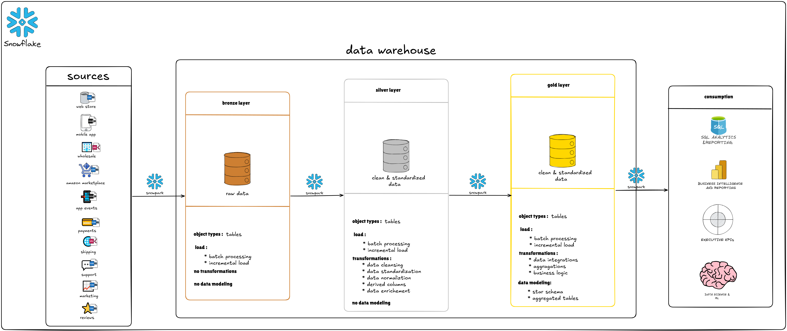
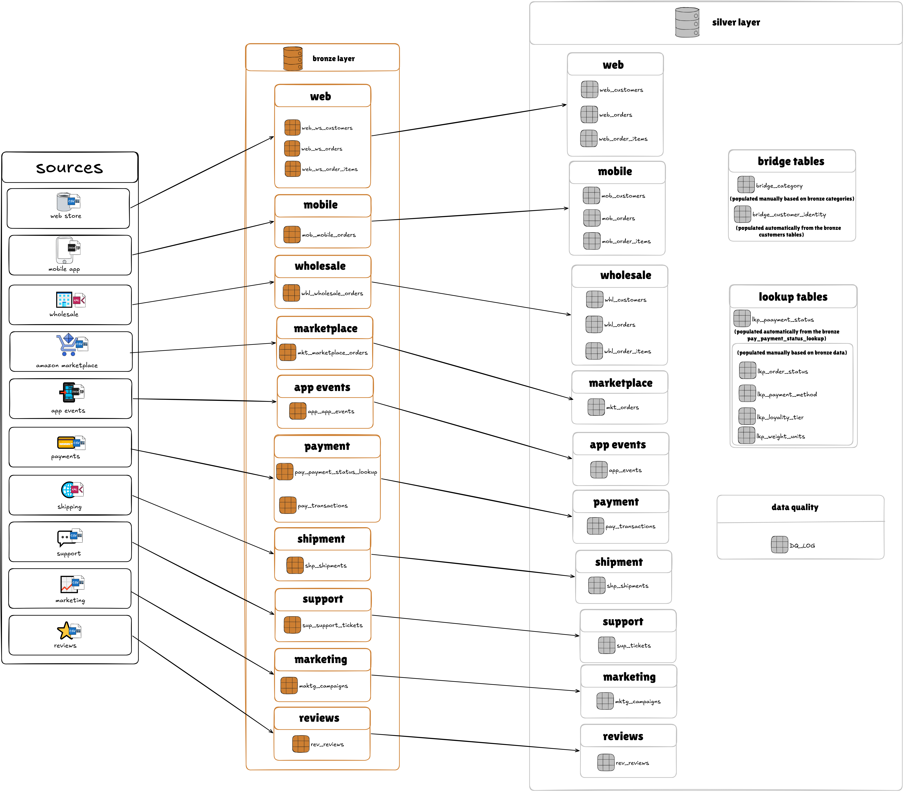

# E-Commerce Multi-Source Data Warehouse

A production-grade data warehouse built on **Snowflake** using **Snowpark Python**, implementing the **Medallion Architecture** (Bronze → Silver → Gold) to unify 10 heterogeneous e-commerce source systems into a single, analytics-ready star schema.



---

## Table of Contents

- [Why I Built This](#why-i-built-this)
- [Architecture Overview](#architecture-overview)
- [Source Systems & Data Challenges](#source-systems--data-challenges)
- [Bronze Layer — Raw Ingestion](#bronze-layer--raw-ingestion)
- [Silver Layer — Cleansing & Standardization](#silver-layer--cleansing--standardization)
- [Gold Layer — Dimensional Model](#gold-layer--dimensional-model)
- [Data Quality & Testing](#data-quality--testing)
- [How to Run](#how-to-run)
- [Project Structure](#project-structure)
- [Key Achievements](#key-achievements)
- [Technologies Used](#technologies-used)

---

## Why I Built This

Real-world e-commerce businesses rarely operate through a single system. A mid-size retailer typically sells through a web store, a mobile app, a wholesale portal, and third-party marketplaces — each built by a different team, at a different time, using a completely different technology stack.

I built this project to tackle that exact problem: **unifying fragmented, inconsistent data from 10 independent source systems into a single star schema** that supports cross-channel analytics, customer 360 views, and operational reporting.

The core challenge is that the same real-world business event — a customer placing an order — is represented differently in every system. Different column naming conventions (ALL_CAPS, camelCase, PascalCase, hyphenated-lowercase). Different file formats (CSV, JSON, XML). Different date formats (YYYY-MM-DD, Unix milliseconds, DD/MM/YYYY, MM/DD/YYYY HH:MM:SS). Different status vocabularies (`C` vs `COMPLETE` vs `ORD_FULFILLED` vs `Shipped`). Different customer ID systems. Different category taxonomies. Even different data types for the same monetary amounts (VARCHAR strings, floats with precision noise, DECIMALs).

This project demonstrates how to systematically solve each of these integration challenges using a layered Medallion Architecture, where each layer has a clear responsibility and the data quality improves progressively as it moves through the pipeline.

---

## Architecture Overview



```
10 Source Systems → Bronze (raw, zero transformations) → Silver (cleansed, standardized) → Gold (star schema)
```

| Layer | Purpose | Tables | Load Strategy |
|-------|---------|--------|---------------|
| **Bronze** | Raw data ingestion — stored exactly as-is from source files | 13 tables | Incremental (file-level dedup via `_SOURCE_FILE`) |
| **Silver** | Data cleansing, standardization, and enrichment | 24 tables | Incremental (watermark via `_BRONZE_LOAD_TIMESTAMP`) |
| **Gold** | Dimensional model (star schema) for analytics | 25 tables | Incremental (watermark via `_SILVER_LOAD_TIMESTAMP`) |

### Design Principles

- **Snowpark-first**: DataFrames for all transformations where Snowpark APIs exist; raw SQL only for Snowpark gaps (XML loading, schema creation, stage listing)
- **Config-driven ingestion**: New Bronze sources are added by appending a single dict to `SOURCE_CONFIGS` — no code changes required
- **Incremental at every layer**: Each layer tracks what has already been processed and only loads new data
- **Idempotent setup**: All schema/table creation uses `IF NOT EXISTS` — safe to re-run
- **Data quality logging**: Validation failures tracked in `SILVER.DQ_LOG` with severity levels

---

## Source Systems & Data Challenges

### 10 Source Systems

| Code | System | Format | ~Records | Key Challenge |
|------|--------|--------|----------|---------------|
| **WEB** | Web Store (PostgreSQL) | CSV | 3,600 orders | ALL_CAPS abbreviated columns; amounts as VARCHAR strings; ~3% duplicate rows |
| **MOB** | Mobile App (REST API) | JSON | 2,400 orders | Nested JSON with arrays; Unix ms timestamps; float precision noise; ~8% guest checkouts |
| **WHL** | Wholesale Portal (SAP ERP) | XML | 1,200 orders | PascalCase XML tags; DD/MM/YYYY dates; amounts exclude tax; 1 XML doc = 1,200 orders |
| **MKT** | Amazon Marketplace | CSV | 800 orders | One row per line item (not per order); buyer PII masked by Amazon; no order-level total |
| **PAY** | Payment Gateway (Stripe-style) | CSV | 6,000 txns | Retry duplicates; covers Web/Mobile only; ~8% abandoned checkouts; numeric status codes |
| **SHP** | 3PL Logistics | XML | 6,000 shipments | Mixed weight units (GRM/KGM); absent XML tags for in-transit (not null); Y/N boolean strings |
| **SUP** | Helpdesk (Zendesk) | CSV | 800 tickets | Column names with spaces/parens; human-readable datetime strings; empty string instead of NULL |
| **MKTG** | Marketing (Google Sheets) | CSV | 200 campaigns | Special chars in column names (`$ Spent`, `CTR %`); mixed date formats in same column |
| **REV** | Review Aggregator | JSON | 1,500 reviews | Schema split (`stars` vs `rating` by review_id); inconsistent SKU formats; no customer link |
| **APP** | Mobile Clickstream | JSON | 24,000 events | ~15% unauthenticated guest sessions; Unix ms timestamps; product fields only on product events |

### Cross-Source Integration Challenges

**4 different customer ID systems** — Web uses integer `CUST_NO`, Mobile uses `USR_XXXXXX`, Wholesale uses `WHL000XXX`, Marketplace has masked buyer emails. Email address is the only reliable cross-source join key (except for Marketplace, where it's masked by Amazon).

**4 different date formats** — `YYYY-MM-DD` (Web), Unix milliseconds (Mobile/App Events), `DD/MM/YYYY` (Wholesale), `MM/DD/YYYY HH:MM:SS` (Marketplace). Marketing has mixed formats in the same column.

**4 different status vocabularies** — A completed order is `C` (Web), `COMPLETE` (Mobile), `ORD_FULFILLED` (Wholesale), `Shipped` (Marketplace). Five canonical statuses mapped across all sources.

**5 different category taxonomies** — "Electronics" (Web), "Tech & Gadgets" (Mobile), "ELECTRONICS" (Wholesale), "Electronics & Computers" (Marketplace), "Tech & Gadgets" (Reviews). All mapped to canonical code `ELEC`.

**Product identity inconsistency** — Internal SKU format `SKU-XXXXX` is consistent across Web/Mobile/Wholesale/Marketplace, but Reviews use at least 4 inconsistent formats (`sku00042`, `SKU00042`, `P-00042`, `PROD_42`) requiring regex normalization.

---

## Bronze Layer — Raw Ingestion

**Notebook**: [`bronze/BRONZE_INGESTION.ipynb`](bronze/BRONZE_INGESTION.ipynb)

The Bronze layer ingests data from a Snowflake external stage with **zero transformations**. Data is stored exactly as-is from the source files, with only two metadata columns added:

- `_SOURCE_FILE` — Stage path (used for incremental dedup)
- `_LOAD_TIMESTAMP` — UTC timestamp of ingestion

### Key Design Decisions

- **Dynamic table creation**: Tables are auto-created from file schema — no pre-initialization required
- **Config-driven**: Adding a new source system requires appending one entry to `SOURCE_CONFIGS`
- **Format-specific loaders**: CSV uses `session.read.csv()` with auto-detected headers; JSON uses `session.read.json()` with a `RAW_DATA` VARIANT column; XML uses `COPY INTO` (no Snowpark equivalent)
- **Incremental logic**: Files already loaded are identified by checking `_SOURCE_FILE` in the target table — if the stage path exists, the file is skipped
- **Table naming**: `<SOURCECODE>__<ENTITY>` with double underscore (e.g., `WEB__WS_ORDERS`, `MOB__MOBILE_ORDERS`)

### Bronze Tables (13)

| Table | Source Format | Records |
|-------|-------------|---------|
| `WEB__WS_CUSTOMERS` | CSV | ~2,500 |
| `WEB__WS_ORDERS` | CSV | ~3,600 |
| `WEB__WS_ORDER_ITEMS` | CSV | ~12,000 |
| `MOB__MOBILE_ORDERS` | JSON (nested) | ~2,400 |
| `WHL__WHOLESALE_ORDERS` | XML (nested) | ~1,200 |
| `MKT__MARKETPLACE_ORDERS` | CSV | ~800 |
| `PAY__TRANSACTIONS` | CSV | ~6,000 |
| `PAY__PAYMENT_STATUS_LOOKUP` | CSV | 4 |
| `SHP__SHIPMENTS` | XML | ~6,000 |
| `SUP__SUPPORT_TICKETS` | CSV | ~800 |
| `MKTG__CAMPAIGNS` | CSV | ~200 |
| `REV__REVIEWS` | JSON | ~1,500 |
| `APP__APP_EVENTS` | JSON | ~24,000 |

---

## Silver Layer — Cleansing & Standardization

**Setup**: [`silver/SILVER_SETUP.ipynb`](silver/SILVER_SETUP.ipynb) (lookup tables, bridge tables — run once)  
**Incremental Load**: [`silver/SILVER_INCREMENTAL_LOAD.ipynb`](silver/SILVER_INCREMENTAL_LOAD.ipynb) (transforms Bronze → Silver — run on schedule)

The Silver layer contains **cleaned, standardized, source-aligned tables** with canonical values ready for cross-source joining.

### Silver Tables (24 total)

**16 Data Tables** — Channel-specific orders, customers, and unified operational data:
- Orders: `WEB_ORDERS`, `MOB_ORDERS`, `WHL_ORDERS`, `MKT_ORDERS`
- Order Items: `WEB_ORDER_ITEMS`, `MOB_ORDER_ITEMS`, `WHL_ORDER_ITEMS`
- Customers: `WEB_CUSTOMERS`, `MOB_CUSTOMERS`, `WHL_CUSTOMERS`
- Operations: `PAY_TRANSACTIONS`, `SHP_SHIPMENTS`, `SUP_TICKETS`, `MKTG_CAMPAIGNS`, `REV_REVIEWS`, `APP_EVENTS`

**5 Lookup Tables** — Reference data for standardization:
- `LKP_ORDER_STATUS` — Maps 4 status vocabularies to canonical values
- `LKP_PAYMENT_STATUS` — Payment status codes from gateway
- `LKP_PAYMENT_METHOD` — Payment method codes and categories
- `LKP_LOYALTY_TIER` — Cross-channel loyalty tier mapping
- `LKP_WEIGHT_UNITS` — Weight unit conversion factors

**2 Bridge Tables** — Cross-source linking:
- `BRIDGE_CUSTOMER_IDENTITY` — Email-based cross-channel customer identity resolution
- `BRIDGE_CATEGORY` — Maps 5 different category taxonomies to canonical codes

**1 Data Quality Log**:
- `DQ_LOG` — Logs all transformation issues with severity levels

### Transformations Applied

| Transformation | Details |
|----------------|---------|
| **Deduplication** | Web orders: ~3% duplicates removed via `ROW_NUMBER() PARTITION BY ORD_NO ORDER BY LAST_UPD_DT DESC`. Payment retries: latest successful transaction kept. |
| **Date parsing** | 4+ date formats unified: `TRY_TO_DATE` for ISO strings, `TO_TIMESTAMP(field/1000)` for Unix ms, `TO_DATE(field, 'DD/MM/YYYY')` for wholesale, `TRY_TO_TIMESTAMP(field, 'MM/DD/YYYY HH24:MI:SS')` for marketplace. Marketing mixed formats handled via `COALESCE(TRY_TO_DATE(...), TRY_TO_DATE(...))`. |
| **Status standardization** | All status codes mapped to canonical values (completed, processing, shipped, cancelled, returned) via `LKP_ORDER_STATUS` lookup joins. |
| **Category normalization** | 5 different taxonomy systems mapped to 10 canonical codes (ELEC, CLTH, HOME, etc.) via `BRIDGE_CATEGORY`. |
| **Type casting** | VARCHAR amounts → DECIMAL(10,2) via `TRY_TO_DECIMAL()`. Float amounts → `ROUND(value::DECIMAL, 2)` to eliminate precision noise. Y/N flags → BOOLEAN via CASE. |
| **NULL handling** | Empty strings → NULL via `NULLIF(field, '')`. Missing JSON fields → `COALESCE(field, default)`. Absent XML tags handled naturally (return NULL). |
| **Weight normalization** | Mixed GRM/KGM units → standardized to kilograms (`CASE WHEN unit='GRM' THEN value/1000 ELSE value END`). |
| **Identity resolution** | `BRIDGE_CUSTOMER_IDENTITY` built from all customer tables using email as the canonical join key. Links Web `CUST_NO` ↔ Mobile `USR_XXXXXX` ↔ Wholesale `WHL000XXX`. |
| **JSON flattening** | Mobile order items: `LATERAL FLATTEN(input => RAW_DATA:orderItems)` to explode nested arrays. Customer info extracted from nested JSON objects. |
| **XML parsing** | Wholesale: `SPLIT_TO_TABLE` + `REGEXP_SUBSTR` to explode 1 XML document into 1,200 individual order rows. |
| **SKU normalization** | Review product SKUs normalized via `REGEXP_REPLACE(UPPER(sku), '[^0-9]', '')::INT` then reformatted to `SKU-XXXXX`. |
| **Marketplace aggregation** | Marketplace source data is at line-item grain — no separate aggregation needed at Silver (aggregation happens at Gold for FACT_ORDERS). |

### Snowpark/Snowflake Technical Patterns

Several Snowflake-specific patterns were discovered and applied during development:

- **Quoted identifiers**: Bronze CSV columns are case-sensitive lowercase — must use `col('"column_name"')` (inner double quotes) in Snowpark
- **Date parsing limitation**: Snowpark `to_date()` does not accept format string parameters — must use `sql_expr()` or `.cast(DateType())`
- **FLATTEN join constraint**: `LATERAL FLATTEN` cannot be on the left side of a LEFT JOIN — must wrap in a SQL subquery
- **XML array extraction**: `XMLGET` returns only first element; `PARSE_XML` returns XML data type not VARIANT — solved with `SPLIT_TO_TABLE` + `REGEXP_SUBSTR` pattern

---

## Gold Layer — Dimensional Model

**Setup**: [`gold/GOLD_SETUP.ipynb`](gold/GOLD_SETUP.ipynb) (DDLs + seed DIM_DATE/DIM_CHANNEL — run once)  
**Dimension Load**: [`gold/GOLD_INCREMENTAL_LOAD_DIMENSIONS.ipynb`](gold/GOLD_INCREMENTAL_LOAD_DIMENSIONS.ipynb) (all 12 dimensions)  
**Fact Load**: [`gold/GOLD_INCREMENTAL_LOAD_FACTS.ipynb`](gold/GOLD_INCREMENTAL_LOAD_FACTS.ipynb) (all 10 fact tables + 3 extensions)


The Gold layer implements a **star schema** with 12 dimension tables, 10 fact tables, and 3 extension tables — optimized for SQL analytics, BI tools, and executive dashboards.

For a detailed consumer-facing reference of every column, type, and query pattern, see the [Gold Data Catalog](GOLD_DATA_CATALOG.md).

### Design Patterns

**Core + Extensions**: FACT_ORDERS contains only columns common to all 4 channels. Channel-specific attributes are stored in extension tables (MOBILE_EXT, WHOLESALE_EXT, MARKETPLACE_EXT), joined via `ORDER_KEY`. This eliminates NULLs while maintaining a single source of truth.

**SCD Type 2**: Three dimensions track historical changes — `DIM_CUSTOMER` (loyalty tier, account status, contact info), `DIM_PRODUCT` (product status, primary category), and `DIM_CAMPAIGN` (campaign name, status, end date). Each has `EFFECTIVE_DATE`, `VALID_TO`, and `IS_CURRENT` columns.

**Surrogate Keys**: All dimensions use auto-generated integer surrogate keys (`*_KEY`) for join performance and SCD Type 2 support. Business keys remain for reference.

**Derived Measures**: Calculated fields added in Gold — `DAYS_TO_DELIVER`, `ON_TIME_DELIVERY_FLAG` (shipments), `DAYS_TO_SOLVE`, `IS_SOLVED` (support tickets), `ACTIVE_MINUTES` (user engagement).

**Aggregated Facts**: `FACT_USER_DAILY_ENGAGEMENT` aggregates raw app events to daily user grain with session counts, funnel metrics (view → cart → checkout → complete), and engagement measures. Raw event data remains in Silver for drill-down.

### Dimension Tables (12)

| Table | Source | Rows | Type | Key Business Attributes |
|-------|--------|------|------|------------------------|
| `DIM_CUSTOMER` | Bridge + Web/Mob/Whl Customers | 1,579 | SCD2 | Unified cross-channel customer; type (B2B/B2C); loyalty tier; channels used |
| `DIM_PRODUCT` | All order item tables | 300 | SCD2 | SKU; category; price snapshots (current, avg, min, max); status |
| `DIM_DATE` | Generated | 2,098 | Static | Full calendar with fiscal periods, holidays, day names |
| `DIM_CHANNEL` | Seeded | 4 | Static | Web Store, Mobile App, Wholesale Portal, Marketplace |
| `DIM_CATEGORY` | Bridge Category | 10 | Static | Canonical product categories |
| `DIM_ORDER_STATUS` | LKP_ORDER_STATUS | 5 | Static | Canonical order statuses with categories (Open/Closed/Cancelled) |
| `DIM_PAYMENT_METHOD` | LKP_PAYMENT_METHOD | 7 | Static | Credit Card, Debit Card, PayPal, Apple Pay, etc. |
| `DIM_PAYMENT_STATUS` | LKP_PAYMENT_STATUS | 4 | Static | Succeeded, Failed, Pending, Refunded |
| `DIM_LOYALTY_TIER` | LKP_LOYALTY_TIER | 4 | Static | Standard, Silver, Gold, Platinum with rank |
| `DIM_PAYMENT_TERMS` | WHL_ORDERS | 5 | Static | NET30, NET60, COD, PREPAID with days-to-pay |
| `DIM_MARKETING_CHANNEL` | MKTG_CAMPAIGNS | 11 | Static | Email, Social Media, Search, Display, etc. (distinct from DIM_CHANNEL) |
| `DIM_CAMPAIGN` | MKTG_CAMPAIGNS | 60 | SCD2 | Campaign name, target segment, dates, status |

### Fact Tables (10 + 3 Extensions)

| Table | Grain | Rows | Key Measures |
|-------|-------|------|-------------|
| `FACT_ORDERS` | 1 per order | 8,000 | ORDER_AMOUNT, ORDER_AMOUNT_USD, TAX_AMOUNT |
| `FACT_ORDER_ITEMS` | 1 per line item | 16,990 | QUANTITY, UNIT_PRICE, LINE_TOTAL, MARKETPLACE_FEE |
| `FACT_PAYMENTS` | 1 per transaction | 5,490 | GROSS_AMOUNT, FEE_AMOUNT, NET_AMOUNT |
| `FACT_SHIPMENTS` | 1 per shipment | 6,057 | PACKAGE_WEIGHT_KG, DAYS_TO_DELIVER, INSURANCE_VALUE |
| `FACT_REVIEWS` | 1 per review | 1,315 | STAR_RATING, HELPFUL_VOTES |
| `FACT_SUPPORT_TICKETS` | 1 per ticket | 960 | FIRST_REPLY_HOURS, CSAT_SCORE, DAYS_TO_SOLVE |
| `FACT_USER_DAILY_ENGAGEMENT` | 1 per user per day | 25,152 | SESSION_COUNT, PRODUCT_VIEW_COUNT, ADD_TO_CART_COUNT, funnel metrics |
| `FACT_CAMPAIGN_DAILY` | 1 per campaign per day | 1,465 | AMOUNT_SPENT, IMPRESSIONS, CLICKS, CONVERSIONS, CTR, CPC, CPA |
| `FACT_ORDERS_MOBILE_EXT` | 1 per mobile order | 2,400 | PLATFORM_TYPE (iOS/Android), SOURCE_ORDER_ID |
| `FACT_ORDERS_WHOLESALE_EXT` | 1 per wholesale order | 1,200 | BUYER_PO_NUMBER, PAYMENT_TERMS_KEY, ORDER_AMOUNT_EXCL_TAX |
| `FACT_ORDERS_MARKETPLACE_EXT` | 1 per marketplace order | 800 | AMAZON_ORDER_ID, FULFILLMENT_CHANNEL (FBA/FBM) |

### Known Limitations

- **Marketplace orders have no customer link**: Amazon masks buyer email — `CUSTOMER_KEY` is NULL for all 800 marketplace orders. This is an Amazon data sharing policy constraint, not a pipeline bug.
- **Reviews cannot be linked to customers**: Reviews use `REVIEWER_HANDLE` (anonymous username) — no `ORDER_ID` or `CUSTOMER_ID` available for cross-referencing.
- **Incomplete customer profiles**: Web customers are most complete (all fields); Mobile has limited fields (no phone, city, postal code); Wholesale has minimal fields (only email and company name).
- **~15% guest app sessions have no customer link**: Unauthenticated mobile app events have no `USER_ID` — `CUSTOMER_KEY` is NULL in `FACT_USER_DAILY_ENGAGEMENT`.

---

## Data Quality & Testing

### Data Quality Log

The Silver layer logs all transformation issues to `SILVER.DQ_LOG` with:
- **Issue types**: duplicate, missing_value, invalid_format, constraint_violation
- **Severity levels**: warning, error, critical
- **Details**: Source table, target table, field name, original value, corrected value, resolution action

### Automated Test Suite

**File**: [`gold/GOLD_DATA_MODEL_TESTS.py`](gold/GOLD_DATA_MODEL_TESTS.py) — 76 automated tests across 6 sections:

| Section | Tests | What It Validates |
|---------|-------|-------------------|
| **1. Referential Integrity** | 20 | Every FK in every fact table resolves to a valid PK in its dimension (zero orphan rows) |
| **2. NULL FK Coverage** | 12 | FK NULL rates are within expected ranges (e.g., ~10% NULL CUSTOMER_KEY for marketplace orders) |
| **3. Analytical Joins** | 11 | Multi-table star schema joins return expected row counts (revenue by channel, customer LTV, full order journey) |
| **4. Extension Tables** | 4 | Each extension table contains only rows from its correct channel; marketplace orders have NULL CUSTOMER_KEY |
| **5. Data Consistency** | 6 | Order amounts match line item totals; SCD2 has exactly 1 current row per entity; no duplicate composite keys |
| **6. Row Counts** | 23 | Every table has rows within expected min/max bounds |

**Latest test results**: 75 PASSED, 0 FAILED, 1 WARNING (DIM_MARKETING_CHANNEL has 11 rows vs expected max of 10 — acceptable).

---

## How to Run

### Prerequisites

- Snowflake account with a warehouse, database, and Snowpark enabled
- Source data files uploaded to a Snowflake external stage named `@source_systems/`
- Python environment with `snowflake-snowpark-python` (or execute in Snowflake Notebooks)

### Execution Order

```
Step 1: bronze/BRONZE_INGESTION.ipynb              — Load raw data from stage (run cells 1→7)
Step 2: silver/SILVER_SETUP.ipynb                   — Create lookup/bridge tables (run once)
Step 3: silver/SILVER_INCREMENTAL_LOAD.ipynb        — Transform Bronze → Silver (run cells 1→55)
Step 4: gold/GOLD_SETUP.ipynb                       — Create Gold schema + seed DIM_DATE/DIM_CHANNEL (run once)
Step 5: gold/GOLD_INCREMENTAL_LOAD_DIMENSIONS.ipynb — Load all 12 dimensions
Step 6: gold/GOLD_INCREMENTAL_LOAD_FACTS.ipynb      — Load all 10 fact tables + 3 extensions
Step 7: gold/GOLD_DATA_MODEL_TESTS.py               — Validate the Gold layer (76 automated tests)
```

**For incremental refreshes**, re-run Steps 1, 3, 5, and 6 — each layer's watermark logic will automatically process only new data.

### Debugging

- **Bronze load failures**: Check `LIST @source_systems/folder/` and the cell 6 summary report (`[!]` flags indicate errors)
- **Silver transformation issues**: Query `SILVER.DQ_LOG` for logged data quality issues
- **Gold test failures**: Run `GOLD_DATA_MODEL_TESTS.py` — the summary section lists all failures with root cause details

---

## Project Structure

```
e_commerce/
│
├── bronze/
│   └── BRONZE_INGESTION.ipynb                     # Raw data ingestion from 10 source systems
│
├── silver/
│   ├── SILVER_SETUP.ipynb                         # Lookup/bridge table infrastructure (run once)
│   └── SILVER_INCREMENTAL_LOAD.ipynb              # Bronze → Silver transformations (16 tables)
│
├── gold/
│   ├── GOLD_SETUP.ipynb                           # Star schema DDLs + seed dimensions (run once)
│   ├── GOLD_INCREMENTAL_LOAD_DIMENSIONS.ipynb     # Load 12 dimension tables
│   ├── GOLD_INCREMENTAL_LOAD_FACTS.ipynb          # Load 10 fact + 3 extension tables
│   └── GOLD_DATA_MODEL_TESTS.py                   # Automated test suite (76 tests)
│
├── images/
│   ├── high_level_architecture.png                # Medallion architecture overview
│   ├── sources_to_silver_lineage.png              # Source systems → Bronze → Silver lineage
│   └── silver_to_gold_lineage.png                 # Silver → Gold star schema lineage
│
├── GOLD_DATA_CATALOG.md                           # Consumer-facing Gold layer data catalog
└── README.md                                      # Project documentation
```

---

## Key Achievements

### Data Integration
- **Unified 10 independent source systems** across 3 file formats (CSV, JSON, XML) into a single queryable star schema
- **Resolved 4 separate customer identity systems** into a unified customer dimension using email-based identity bridging — linking Web, Mobile, and Wholesale customers into 1,579 canonical customer profiles
- **Mapped 5 different category taxonomies** to 10 canonical category codes using a bridge table
- **Standardized 4 different status vocabularies** into 5 canonical order statuses via lookup-driven transformation
- **Parsed 6+ different date/timestamp formats** including Unix milliseconds, mixed formats in the same column, and human-readable datetime strings

### Data Engineering
- **End-to-end Medallion Architecture** with 3 fully operational layers (62 tables total: 13 Bronze + 24 Silver + 25 Gold)
- **Incremental loading at every layer** — watermark-based processing prevents duplicate loads and enables scheduled refreshes
- **SCD Type 2 dimensions** for customer, product, and campaign tracking — supporting point-in-time analytics
- **Core + Extensions fact table pattern** that cleanly separates common order attributes from channel-specific data without NULLs
- **Event stream aggregation** — raw mobile app events (24,000+) aggregated into daily user engagement metrics with funnel analysis (view → cart → checkout → complete)

### Data Quality
- **76 automated data model tests** covering referential integrity, NULL coverage, analytical joins, extension table correctness, data consistency, and row count health checks
- **All tests passing** with zero failures against production data
- **Data Quality Log** (`DQ_LOG`) capturing every transformation issue with severity tracking
- **Deduplication at source** — Web order duplicates (~3%), payment retries, and bridge table fan-outs all handled systematically

### Technical Challenges Solved
- **XML to relational**: 1 XML document containing 1,200 orders exploded using `SPLIT_TO_TABLE` + `REGEXP_SUBSTR` after working around Snowflake `XMLGET`/`PARSE_XML` limitations
- **Nested JSON flattening**: `LATERAL FLATTEN` for order items arrays with a subquery pattern to work around Snowflake's left-join constraint
- **Cross-source currency handling**: Amounts stored in original currency with USD conversion and exchange rates in FACT_ORDERS
- **Marketplace two-pass processing**: Line-item grain data processed directly for FACT_ORDER_ITEMS, aggregated to order level for FACT_ORDERS
- **Customer identity deduplication**: Bridge table had duplicate (canonical_id, source_system) rows from multiple guest IDs — resolved with `ROW_NUMBER` dedup preferring non-guest IDs
- **Payment channel mapping**: Source channel abbreviations (MOB/WEB) mapped to canonical channel names (mobile/web) for dimension key resolution

---

## Technologies Used

| Technology | Usage |
|-----------|-------|
| **Snowflake** | Cloud data warehouse — compute, storage, and SQL engine |
| **Snowpark Python** | DataFrame API for ETL transformations in Python |
| **SQL** | DDLs, complex XML/JSON parsing, window functions, SCD Type 2 logic |
| **Medallion Architecture** | Three-layer data pipeline pattern (Bronze → Silver → Gold) |
| **Star Schema** | Dimensional modeling with surrogate keys, SCD Type 2, and fact/dimension separation |
| **Jupyter/Snowflake Notebooks** | Interactive development and execution environment |
